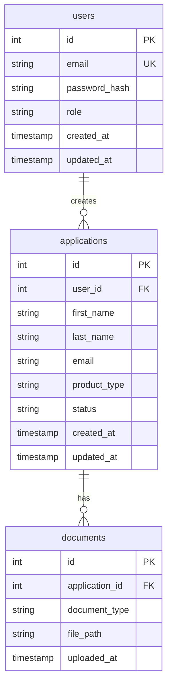

# Onboarding Platform - Project Overview

## 🎯 Executive Summary

**What:** Production-grade fintech onboarding API for customer account applications

**Why:** Portfolio project to demonstrate backend development skills and unlock job opportunities

**Tech Stack:** Node.js, Express, PostgreSQL, Jest, JWT

**Timeline:** 4 weeks to completion

**Career Impact:** Unlocks applications to Codevista, SpruceID, and Halvik

---

## 🏗️ System Architecture

```
┌─────────────────────────────────────────────────────────────┐
│                        CLIENT LAYER                          │
│  (Postman, curl, or future React frontend)                  │
└────────────────────────┬────────────────────────────────────┘
                         │
                         │ HTTP Requests
                         ▼
┌─────────────────────────────────────────────────────────────┐
│                    EXPRESS API SERVER                        │
│                                                              │
│  ┌────────────────────────────────────────────────────┐    │
│  │              MIDDLEWARE LAYER                       │    │
│  │  • Body Parser (JSON)                              │    │
│  │  • Authentication (JWT)                            │    │
│  │  • Authorization (Role-based)                      │    │
│  │  • Error Handler                                   │    │
│  └────────────────────┬───────────────────────────────┘    │
│                       │                                      │
│  ┌────────────────────▼───────────────────────────────┐    │
│  │              ROUTES LAYER                           │    │
│  │  • /health                                         │    │
│  │  • /auth (register, login)                         │    │
│  │  • /applications (create)                          │    │
│  │  • /admin/applications (view, update)              │    │
│  └────────────────────┬───────────────────────────────┘    │
│                       │                                      │
│  ┌────────────────────▼───────────────────────────────┐    │
│  │           CONTROLLERS LAYER                         │    │
│  │  • authController (register, login)                │    │
│  │  • applicationController (CRUD operations)         │    │
│  └────────────────────┬───────────────────────────────┘    │
│                       │                                      │
│  ┌────────────────────▼───────────────────────────────┐    │
│  │            MODELS LAYER (Data Access)               │    │
│  │  • User.js (user operations)                       │    │
│  │  • Application.js (application operations)         │    │
│  └────────────────────┬───────────────────────────────┘    │
│                       │                                      │
└───────────────────────┼──────────────────────────────────────┘
                        │
                        │ SQL Queries
                        ▼
┌─────────────────────────────────────────────────────────────┐
│                   POSTGRESQL DATABASE                        │
│                                                              │
│  ┌──────────────┐  ┌──────────────┐  ┌──────────────┐     │
│  │    users     │  │ applications │  │  documents   │     │
│  ├──────────────┤  ├──────────────┤  ├──────────────┤     │
│  │ id           │  │ id           │  │ id           │     │
│  │ email        │  │ user_id      │  │ app_id       │     │
│  │ password_hash│  │ first_name   │  │ doc_type     │     │
│  │ role         │  │ last_name    │  │ file_path    │     │
│  │ created_at   │  │ email        │  │ uploaded_at  │     │
│  └──────────────┘  │ product_type │  └──────────────┘     │
│                    │ status       │                        │
│                    │ created_at   │                        │
│                    └──────────────┘                        │
└─────────────────────────────────────────────────────────────┘
```

---

## 📊 Database Schema



---

## 🔄 API Request Flow

### Example: Creating an Application

```
1. Client Request
   POST /applications
   {
     "firstName": "John",
     "lastName": "Doe",
     "email": "john@example.com"
   }
   
2. Express Middleware
   ↓ Body Parser: Parse JSON
   ↓ Validation: Check required fields
   
3. Route Handler
   ↓ Match route: POST /applications
   ↓ Call: applicationController.createApplication
   
4. Controller
   ↓ Validate input
   ↓ Call: Application.create(data)
   
5. Model (Data Access Layer)
   ↓ Build SQL query
   ↓ Execute: INSERT INTO applications...
   
6. PostgreSQL
   ↓ Insert record
   ↓ Return: new application with ID
   
7. Response Flow (back up)
   Model → Controller → Route → Client
   
8. Client Response
   {
     "applicationId": 1,
     "status": "submitted"
   }
```

---

## 🔐 Authentication Flow

```
Registration Flow:
1. POST /auth/register { email, password }
2. Hash password with bcrypt
3. Store user in database
4. Generate JWT token
5. Return token to client

Login Flow:
1. POST /auth/login { email, password }
2. Find user by email
3. Compare password with bcrypt
4. Generate JWT token
5. Return token to client

Protected Route Access:
1. Client sends: Authorization: Bearer <token>
2. Middleware extracts and verifies token
3. Attach user info to request
4. Check role permissions
5. Allow or deny access
```

---

## 📁 Project Structure

```
onboarding-platform/
│
├── backend/
│   ├── src/
│   │   ├── config/
│   │   │   └── database.js          # PostgreSQL connection
│   │   │
│   │   ├── controllers/
│   │   │   ├── authController.js    # Register, login
│   │   │   └── applicationController.js  # CRUD operations
│   │   │
│   │   ├── models/
│   │   │   ├── User.js              # User data access
│   │   │   └── Application.js       # Application data access
│   │   │
│   │   ├── routes/
│   │   │   ├── auth.js              # Auth routes
│   │   │   └── applications.js      # Application routes
│   │   │
│   │   ├── middleware/
│   │   │   ├── auth.js              # JWT authentication
│   │   │   └── validation.js        # Input validation
│   │   │
│   │   ├── utils/
│   │   │   └── errors.js            # Custom error classes
│   │   │
│   │   └── index.js                 # Server entry point
│   │
│   ├── tests/
│   │   ├── unit/
│   │   │   └── models/
│   │   │       ├── User.test.js
│   │   │       └── Application.test.js
│   │   │
│   │   └── integration/
│   │       ├── auth.test.js
│   │       └── applications.test.js
│   │
│   ├── migrations/
│   │   └── 001_initial_schema.sql   # Database schema
│   │
│   ├── scripts/
│   │   └── migrate.js               # Migration runner
│   │
│   ├── .env                         # Environment variables (not in git)
│   ├── .env.example                 # Example env file
│   ├── .gitignore
│   ├── package.json
│   └── README.md
│
├── plans/                           # Career strategy docs
│   ├── career-strategy-analysis.md
│   ├── executive-summary.md
│   └── linkedin-and-interview-strategy.md
│
├── COMPLETE_ROADMAP.md              # Step-by-step implementation guide
├── IMPLEMENTATION_PLAN.md           # Detailed technical specs
├── QUICK_START.md                   # Getting started guide
├── PROJECT_OVERVIEW.md              # This file
└── README.md                        # Project README
```

---

## 🎯 Feature Roadmap

### Phase 1: Foundation (Week 1)
- [x] Basic Express server
- [ ] Git repository setup
- [ ] Project structure organization
- [ ] PostgreSQL installation
- [ ] Database schema design

### Phase 2: Core Features (Week 2)
- [ ] Database integration
- [ ] Application CRUD operations
- [ ] Testing infrastructure
- [ ] 80%+ test coverage

### Phase 3: Security (Week 3)
- [ ] User registration
- [ ] User login
- [ ] JWT authentication
- [ ] Protected admin routes
- [ ] Password hashing

### Phase 4: Production Ready (Week 4)
- [ ] Error handling
- [ ] Input validation
- [ ] API documentation
- [ ] Deployment to Heroku/Railway
- [ ] Professional README

### Phase 5: Enhancements (Optional)
- [ ] File upload for documents
- [ ] Email notifications
- [ ] Rate limiting
- [ ] Logging and monitoring
- [ ] React admin dashboard

---

## 🧪 Testing Strategy

```
Testing Pyramid:

        ┌─────────────┐
        │     E2E     │  (Future: Full user flows)
        └─────────────┘
       ┌───────────────┐
       │  Integration  │  (API endpoint tests)
       └───────────────┘
      ┌─────────────────┐
      │      Unit       │  (Model & utility tests)
      └─────────────────┘

Current Focus:
• Unit Tests: Models (User, Application)
• Integration Tests: API endpoints
• Target: 80%+ coverage
```

---

## 🚀 Deployment Architecture

```
Development:
┌──────────────┐
│ Local Machine│
│ localhost:3000│
│ PostgreSQL   │
└──────────────┘

Production (Heroku/Railway):
┌─────────────────────────────────┐
│         Cloud Platform          │
│  ┌──────────────────────────┐  │
│  │   Node.js App Instance   │  │
│  │   (Express Server)       │  │
│  └───────────┬──────────────┘  │
│              │                  │
│  ┌───────────▼──────────────┐  │
│  │  Managed PostgreSQL DB   │  │
│  └──────────────────────────┘  │
└─────────────────────────────────┘
         ▲
         │ HTTPS
         │
    ┌────┴────┐
    │ Clients │
    └─────────┘
```

---

## 📈 Success Metrics

### Technical Metrics
- ✅ 80%+ test coverage
- ✅ All tests passing
- ✅ No security vulnerabilities
- ✅ API response time < 200ms
- ✅ Zero downtime deployment

### Career Metrics
- ✅ Portfolio-ready project
- ✅ Interview talking points
- ✅ Demonstrates production thinking
- ✅ Shows learning ability
- ✅ Proves backend competency

---

## 🎓 Skills Demonstrated

### Backend Development
- RESTful API design
- Database schema design
- SQL queries and optimization
- Authentication patterns
- Error handling

### Code Quality
- Test-driven development
- Clean architecture
- Separation of concerns
- Input validation
- Security best practices

### DevOps
- Git workflow
- Environment configuration
- Database migrations
- Deployment process
- Monitoring and logging

### Professional Skills
- Documentation
- Project planning
- Problem-solving
- Technical communication
- Incremental development

---

## 🔗 Key Resources

### Documentation
- [Complete Roadmap](COMPLETE_ROADMAP.md) - Step-by-step guide
- [Quick Start](QUICK_START.md) - Getting started
- [Implementation Plan](IMPLEMENTATION_PLAN.md) - Technical details
- [Career Strategy](plans/executive-summary.md) - Job search plan

### External Resources
- [PostgreSQL Docs](https://www.postgresql.org/docs/)
- [Express.js Guide](https://expressjs.com/)
- [Jest Documentation](https://jestjs.io/)
- [JWT.io](https://jwt.io/)

---

## 💡 Interview Talking Points

When discussing this project in interviews:

### Technical Decisions
- "I chose PostgreSQL over MongoDB because financial data requires ACID guarantees and relational integrity"
- "I implemented JWT authentication for stateless, scalable auth across multiple servers"
- "I achieved 85% test coverage using Jest for both unit and integration tests"

### Challenges Overcome
- "Migrating from in-memory to PostgreSQL taught me about database connection pooling and query optimization"
- "Writing tests first (TDD) helped me design better APIs and catch edge cases early"
- "Implementing authentication required understanding bcrypt, JWT, and security best practices"

### What You'd Do Differently
- "In production, I'd add Redis for caching and session management"
- "I'd implement rate limiting to prevent abuse"
- "I'd add comprehensive logging and monitoring with tools like DataDog"

---

## 🎯 Next Steps

1. **Read** [`QUICK_START.md`](QUICK_START.md) for immediate action items
2. **Follow** [`COMPLETE_ROADMAP.md`](COMPLETE_ROADMAP.md) phase by phase
3. **Track** progress using the todo list
4. **Commit** code regularly to GitHub
5. **Test** thoroughly at each phase
6. **Deploy** when core features are complete
7. **Apply** to jobs with confidence!

---

**Remember:** This project is your ticket to demonstrating real skills. Take it step-by-step, learn deeply, and build something you're proud to show employers.

**You've got this! 🚀**
